  

  

---

## 🧑‍💻 About Me

- 🎓 Informatics Engineering student at **Institut Teknologi Sumatera (ITERA)**
- 🌱 Focused on **web development**, **backend systems**, and **networking**
- 💻 Daily stack: PHP (XAMPP) · Python · MySQL · JavaScript
- 📫 Email: [ferli.120140018@student.itera.ac.id](mailto:ferli.120140018@student.itera.ac.id)

---

## 🛠️ Skills & Tech Stack

---

## 📊 GitHub Stats

  
  

---

## 📬 Contact

---

  ⚡ Built with markdown, shields.io & github-readme-stats

